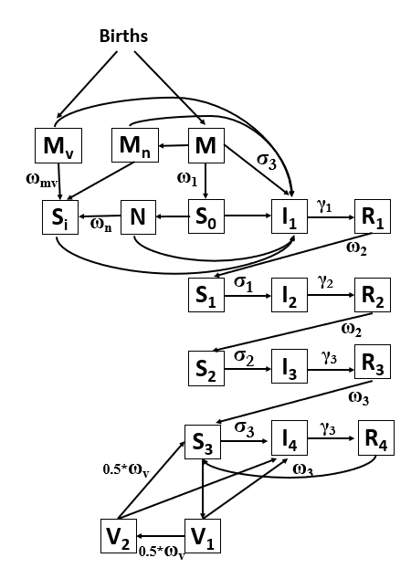

<!-- README.md is generated from README.Rmd. Please edit that file -->

```{r, include = FALSE}
knitr::opts_chunk$set(
  collapse = TRUE,
  comment = "#>",
  fig.path = "man/figures/README-",
  out.width = "100%",
  warning=FALSE,
  message=FALSE
)
```

# R.Scenario.Vax

<!-- badges: start -->
<!-- badges: end -->

The goal of R.Scenario.Vax is to fit a deterministic, compartmental transmission model to RSV hospitalization data and provide scenario projections for the number of hospitalizations averted due to new immunization products. 

## Installation

You can install the development version of R.Scenario.Vax from [GitHub](https://github.com/) with:

``` {r install, eval=FALSE}
# install.packages("remotes")
remotes::install_github("chelsea-hansen/R.Scenario.Vax")
```

## Model Diagram



## Fixed Model Parameters

|Parameter|Value|
|---|---|
|<sup>1</sup>Duration of infectiousness - first infection (1/&gamma;<sub>1</sub>)|10 days|
|<sup>1</sup>Duration of infectiousness - second infection (1/&gamma;<sub>2</sub>)|7 days|
|<sup>1</sup>Duration of infectiousness - third or later infection (1/&gamma;<sub>3</sub>)|5 days|
|<sup>2</sup>Relative risk of infection following first infection (&sigma;<sub>1</sub>)|0.89|
|<sup>2</sup>Relative risk of infection following second infection (&sigma;<sub>2</sub>)|0.72|
|<sup>2</sup>Relative risk of infection following third or later infection (&sigma;<sub>3</sub>)|0.24|
|Relative risk of infection with maternal immunity (same as RR following third infection) (&sigma;<sub>3</sub>)|0.24|
|<sup>1</sup>Duration of maternal immunity (1/&omega;<sub>1</sub>)|112 days|
|<sup>3</sup>Duration of immunity following first and second infections (1/&omega;<sub>2</sub>)|182.625 days|
|<sup>2</sup>Duration of immunity following third or later infections (1/&omega;<sub>3</sub>)|358.9 days|
|<sup>1</sup>Relative infectiousness - second infections (&rho;<sub>1</sub>)|0.75|
|<sup>1</sup>Relative infectiousness - third or later infections (&rho;<sub>2</sub>)|0.51|
|Baseline transmission rate (&beta;)|Fitted|
|Amplitude of seasonal forcing (\*b\*1)|Fitted|
|Phase of seasonal forcing (&phi;)|Fitted|
|Infections that lead to reported hospitalizations (<2m, 2-11 months fixed relative to this)|Fitted|
|Infections that lead to reported hospitalizations (1-4yrs)|Fitted|
|Infections that lead to reported hospitalizations (5-64 yrs)|Fitted|
|Infections that lead to reported hospitalizations (65-74 yrs)|Fitted|
|Infections that lead to reported hospitalizations (75+ yrs)|Fitted|
|Nirsevimab effectiveness |80%|
|Duration of nirsevimab protection |150 days|
|maternal vaccination effectiveness |55%|
|Duration of protection from maternal vaccination|180 days|
|Vaccine effectiveness in older adults |80%|
|Duration of vaccine effectiveness in older adults|2 years|

References: 1. Pitzer et al.; 2. Hodgson et al.; 3. Ohuma et al. 


## Sample Data

The package includes 2 built-in data sets based on data from RSV-Net [RSV-Net](https://data.cdc.gov/Public-Health-Surveillance/Weekly-Rates-of-Laboratory-Confirmed-RSV-Hospitali/29hc-w46k/about_data).

* `timeseries`: Weekly time series of RSV hospitalizations in 7 states (all ages)

* `age_distribution`: The proportion of RSV hospitalizations in each age group and state (based on the 2018-19 and 2019-20 seasons only)  

Notes: 
* RSV-Net data is only included for the 7 states which began reporting to RSV-Net in 2016.

* RSV-Net provides data on RSV hospitalization rates. We have converted these to an approximate number of hospitalizations for use in the model.

* RSV-Net did not include data for children until 2018. Simulated data for children has been added based on the weekly average RSV hospitalization rate during the 2018-19 and 2019-20 RSV seasons. 

```{r example, echo=FALSE}
library(R.Scenario.Vax)
library(ggplot2)
library(tidyverse)

ggplot(data=timeseries)+
  theme_bw()+
  geom_line(aes(x=date, y=value))+
  facet_wrap(~state,scales="free")+
  labs(x=NULL, y="RSV Hospitalizations",title ="timeseries dataset")

ggplot(data=age_distribution)+
  theme_bw()+
  geom_bar(aes(x=age_group,y=proportion),stat="identity")+
  facet_wrap(~state,scales="free")+
  labs(x="Age Group", y="Proportion of RSV Hospitalizations", title="age_distribution dataset")


```

## Example 

Here we will walk through an example using data from New York state. 

### Step 1: Retrieve starting values and fixed parameters 

The model requires data on birth rates, net migration rates, and the age-specific population distribution. The `get_data()` function will pull the necessary data using the `tidycensus` R package for the year 2022 (most recent available data). The annual birth rate is converted to a weekly number of births and is used to introduce new individuals into the <2m age class. The model assumes that individuals age exponentially into the next age class with the rate of aging equal to the inverse of the time spent in each age class. The net migration rate is applied uniformly across age classes. The model uses an expanded version of the contact matrix described by Mossong et al. to define contacts between age classes. 


The `get_data()` function will retrieve the fixed parameter values as well as the population data needed to run the model. This function returns a list with 3 values. 
1. Fixed parameters 
2. Initial values for model compartments 
3. Vectorized version of the initial values for model compartments


```{r stepone}
library(R.Scenario.Vax)

ny_data = get_data(state_or_county="state",state_abbr="NY",county_name=NULL)

fixed_parameters = ny_data[[1]]
yinit = ny_data[[2]]
yinit.vector = ny_data[[3]]
```

### Step 2: Fit model to data 

the `fit_model()` function will fit model parameters using maximum likelihood estimation. The model will fit 7 parameters in total. But first we will extract the data for New York from the sample data sets. We also only want to fit to data before the COVID-19 pandemic. The function will produce a figure when the fitting is complete showing the fit to the `timeseries` and `age_distribution` data sets. 

```{r steptwo}

timeseries_ny = timeseries %>% filter(state=="New York",date<'2020-04-01')
age_distribution_ny = age_distribution %>% filter(state=="New York")

fitNY = fit_model(time_series = timeseries_ny$value, 
                  age_dist = age_distribution_ny$proportion, 
                  parmset = fixed_parameters,
                  yinit = yinit,
                  yinit.vector = yinit.vector)

```

### Step 3: Scenario Projections

Once you have the fitted parameters, use the `scenario_projection()` function to run scenario projections for the number of RSV hospitalizations based on the number of immunizations administered. We are only running one example here, but you can run many scenarios. If you would like to use the Shiny App to display your results, please make sure to run a counterfactual scenario and name it "Counterfactual" and projection_intervals = TRUE.

```{r stepthree}

scenarioA = scenario_projection(fitted_parms  = fitNY,
                                parmset = fixed_parameters,
                                yinit=yinit,
                                yinit.vector=yinit.vector,
                                data_start = '2016-10-08',
                                projection_start = '2024-10-01',
                                projection_end = '2025-06-01',
                                adult_start = '2024-08-01',
                                adult_end = '2025-05-01',
                                adult75_doses = 400000,
                                adult75_doses_last_year = 750000,
                                adult65_74_doses = 100000,
                                adult65_74_doses_last_year = 250000,
                                maternal_start = '2024-09-01',
                                maternal_end = '2025-01-31',
                                maternal_doses = 50000,
                                monoclonal_catchup_start = '2024-10-01',
                                monoclonal_catchup_end = '2025-03-01',
                                monoclonal_catchup_doses = 75000,
                                monoclonal_birth_start = '2024-10-01',
                                monoclonal_birth_end = '2025-03-01',
                                monoclonal_birth_doses = 75000,
                                scenario_name="Scenario A",
                                projection_intervals=TRUE
)

```

### Step 4: Launch Shiny App

Once you have run several scenarios (including a "Counterfactual"), combine all scenarios using `rbind()` or `bind_rows()` and save as a .rds file. Launch the Shiny App using the code below. The Shiny App will ask you to upload the saved results. 

```{r shiny, eval=FALSE}
display_scenarios()
```
