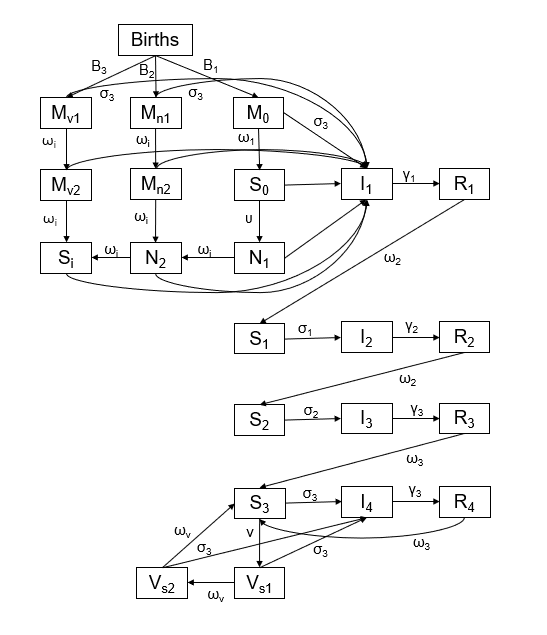
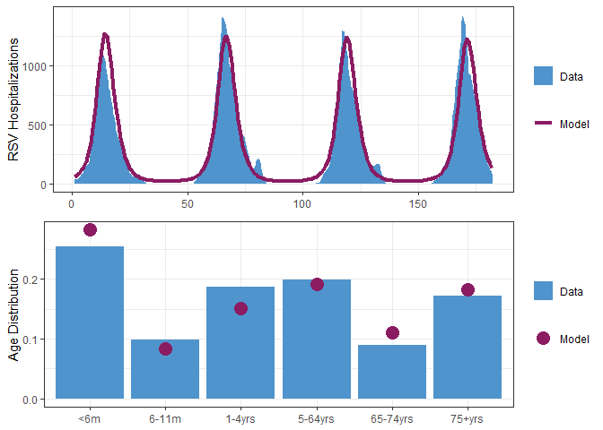
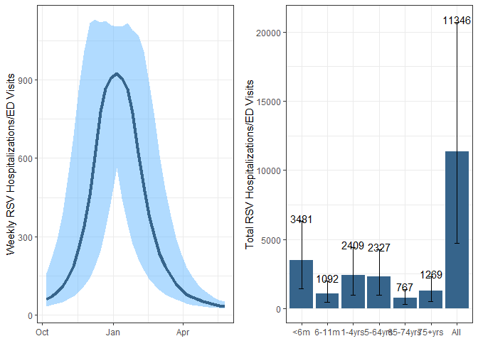

<!-- README.md is generated from README.Rmd. Please edit that file -->

# R.Scenario.Vax

<!-- badges: start -->
<!-- badges: end -->

**R.Scenario.Vax** is an **R** package designed to provide **S**cenario
projections for **RSV** hospitalizations in the context of new
**V**accines and immunizations.

## Installation

You can install the development version of R.Scenario.Vax from
[GitHub](https://github.com/) with:

``` r
# install.packages("remotes")
remotes::install_github("chelsea-hansen/R.Scenario.Vax")
```

## Model Structure



- If no protection is given through immunizations, infants are born into
  the “M0” compartment with partial protection against infection. As
  this protection wanes, they transition to the “S0” compartment until
  they experience their first infection, “I1”.

- After they recover from their first infection, they have a short
  period of sterilizing immunity, “R1”. When this immunity wanes, they
  are susceptible again, “S1”, but with lower risk of infection.

- After each subsequent infection individuals are less infectious,
  recover more quickly, have a longer duration of immunity and a lower
  risk of future infections.

- A proportion of individuals who become infected will require
  hospitalizatio (compartments not shown). The risk of hospitalization
  is based on both age and number of previous infections.

### Infant Immunizations

- Infants born to vaccinated persons start in the “Mv1” compartment.
  These infants have the same protection against infection as the
  infants in the “M” compartment but have additional protection against
  hospitalization given infection.

- After the protection against infection wanes, infants continue to have
  protection against hospitalization given infection, “Mv2”. After this
  protection wanes they no longer have any protection and move to the
  “Si” compartment.

- Some infants receive a dose of monoclonal antibodies at or shortly
  after birth, “Mn1”. These infants have the same protection against
  infection as the infants in the “M” compartment but have additional
  protection against hospitalization given infection.

- After the protection against infection wanes, they continue to have
  protection against hospitalization given infection, “Mn2”. After this
  protection wanes they no longer have any protection and move to the
  “Si” compartment.

- Some infants receive a catch-up dose of monoclonal antibodies before
  the RSV season. which confers protection against hospitalization but
  not protection against infection. These infants move from “S0” to “N1”
  and then to “N2”. Infants spend the same length of time in “N1” and
  “N2” and the level of protection is the same. After this protection
  wanes they no longer have any protection and move to the “Si”
  compartment.

### Vaccination for Older Adults

Adults over 60 who receive a vaccine have a similar risk of infection as
adults in the “S3” compartment, but have some protection against
hospitalization given infection. Upon vaccination adults move to the
“Vs1” compartment and then the “Vs2” compartment. They spend the same
amount of time in each of these compartments and the protection is the
same. After this protection wanes they no longer have any protection
against hospitalization and return to the “S3” compartment.

## Fixed Model Parameters

| Parameter                                                                                                | Value          |
|----------------------------------------------------------------------------------------------------------|----------------|
| <sup>1</sup>Duration of infectiousness - first infection (1/γ<sub>1</sub>)                               | 10 days        |
| <sup>1</sup>Duration of infectiousness - second infection (1/γ<sub>2</sub>)                              | 7 days         |
| <sup>1</sup>Duration of infectiousness - third or later infection (1/γ<sub>3</sub>)                      | 5 days         |
| <sup>2</sup>Relative risk of infection following first infection (σ<sub>1</sub>)                         | 0.89           |
| <sup>2</sup>Relative risk of infection following second infection (σ<sub>2</sub>)                        | 0.72           |
| <sup>2</sup>Relative risk of infection following third or later infection (σ<sub>3</sub>)                | 0.24           |
| Relative risk of infection with maternal immunity (same as RR following third infection) (σ<sub>3</sub>) | 0.24           |
| <sup>1</sup>Duration of maternal immunity (1/ω<sub>1</sub>)                                              | 90 days        |
| <sup>3</sup>Duration of immunity following first and second infections (1/ω<sub>2</sub>)                 | 182.625 days   |
| <sup>2</sup>Duration of immunity following third or later infections (1/ω<sub>3</sub>)                   | 358.9 days     |
| <sup>1</sup>Relative infectiousness - second infections (ρ<sub>1</sub>)                                  | 0.75           |
| <sup>1</sup>Relative infectiousness - third or later infections (ρ<sub>2</sub>)                          | 0.51           |
| Baseline transmission rate (β)                                                                           | Fitted         |
| Amplitude of seasonal forcing (*b*<sub>1</sub>)                                                          | Fitted         |
| Phase of seasonal forcing (φ)                                                                            | Fitted         |
| Infections that lead to reported hospitalizations (\<2m, 2-11 months fixed relative to this)             | Fitted         |
| Infections that lead to reported hospitalizations (1-4 yrs)                                              | Fitted         |
| Infections that lead to reported hospitalizations (5-64 yrs)                                             | Fitted         |
| Infections that lead to reported hospitalizations (65-74 yrs)                                            | Fitted         |
| Infections that lead to reported hospitalizations (75+ yrs)                                              | Fitted         |
| Birth rate for newborns who are not protected by immunizations (B1)                                      | Scenario Based |
| birth rate for newborns protected by monoclonal antibodies (B2)                                          | Scenario Based |
| birth rate for newborns protected by maternal vaccination (B3)                                           | Scenario Based |
| Catch-up immunization rate for monoclonal antibodies (U)                                                 | Scenario Based |
| Vaccination rate for older adults (V)                                                                    | Scenario Based |
| Nirsevimab effectiveness                                                                                 | 80%            |
| maternal vaccination effectiveness                                                                       | 57%            |
| Duration of infant immunizations (both monoclonals and maternal vaccination) 2\*(1/ω<sub>i</sub>)        | 180 days       |
| Vaccine effectiveness in older adults                                                                    | 75%            |
| Duration of vaccine effectiveness in older adults 2\*(1/ω<sub>v</sub>)                                   | 2 years        |

References: 1. Pitzer et al.; 2. Hodgson et al.; 3. Ohuma et al. 

## Sample Data

The package includes 2 built-in data sets based on data from RSV-Net
[RSV-Net](https://data.cdc.gov/Public-Health-Surveillance/Weekly-Rates-of-Laboratory-Confirmed-RSV-Hospitali/29hc-w46k/about_data).

- `timeseries`: Weekly time series of RSV hospitalizations in 7 states
  (all ages)

- `age_distribution`: The proportion of RSV hospitalizations in each age
  group and state (based on the 2018-19 and 2019-20 seasons only)

Notes: \* RSV-Net data is only included for the 7 states which began
reporting to RSV-Net in 2016.

- RSV-Net provides data on RSV hospitalization rates. We have converted
  these to an approximate number of hospitalizations for use in the
  model.

- RSV-Net did not include data for children until 2018. Simulated data
  for children has been added based on the weekly average RSV
  hospitalization rate during the 2018-19 and 2019-20 RSV seasons.

- Data have been inflated to adjust for changes in RSV testing and
  reporting during the COVID-19 pandemic.


## Example

Here we will walk through an example using data from New York state.

### Step 1: Retrieve starting values and fixed parameters

The model requires data on birth rates, net migration rates, and the
age-specific population distribution. The `get_data()` function will
pull the necessary data using the `tidycensus` R package for the year
2022 (most recent available data). The annual birth rate is converted to
a weekly number of births and is used to introduce new individuals into
the \<2m age class. The model assumes that individuals age exponentially
into the next age class with the rate of aging equal to the inverse of
the time spent in each age class. The net migration rate is applied
uniformly across age classes. The model uses an expanded version of the
contact matrix described by Mossong et al. 2008 to define contacts
between age classes.

The `get_data()` function will retrieve the fixed parameter values as
well as the population data needed to run the model. This function
returns a list with 3 values. 1. Fixed parameters 2. Initial values for
model compartments 3. Vectorized version of the initial values for model
compartments

``` r
library(R.Scenario.Vax)

ny_data = get_data(state_or_county="state",state_abbr="NY",county_name=NULL)

fixed_parameters = ny_data[[1]]
yinit = ny_data[[2]]
yinit.vector = ny_data[[3]]
```

### Step 2: Fit model to data

the `fit_model()` function will fit model parameters using maximum
likelihood estimation. The model will fit 7 parameters in total. But
first we will extract the data for New York from the sample data sets.
We also only want to fit to data before the COVID-19 pandemic. The
function will produce a figure when the fitting is complete showing the
fit to the `timeseries` and `age_distribution` data sets.

``` r

timeseries_ny = timeseries %>% filter(state=="New York",date<'2020-04-01')
age_distribution_ny = age_distribution %>% filter(state=="New York")

fitNY = fit_model(time_series = timeseries_ny$value, #Make sure this value is a vector of whole numbers
                  age_dist = age_distribution_ny$proportion, #Make sure this value is a vector
                  parmset = fixed_parameters,
                  yinit = yinit,
                  yinit.vector = yinit.vector)
```



### Common errors

If the time series values are not whole numbers or the values given to
the time_series and age_dist arguments are not vectors, you will receive
an error message. Please see examples below.

``` r

error1 = fit_model(time_series = timeseries_ny$value*1.1, #NOT WHOLE NUMBERS
                  age_dist = age_distribution_ny$proportion, 
                  parmset = fixed_parameters,
                  yinit = yinit,
                  yinit.vector = yinit.vector)
#> Error in optim(par = c(-0.5, -2, 2, -2, -4, -8, -5, -5), fn = fitmodel, : function cannot be evaluated at initial parameters

error2 = fit_model(time_series = timeseries_ny, #NOT A VECTOR
                  age_dist = age_distribution_ny$proportion, 
                  parmset = fixed_parameters,
                  yinit = yinit,
                  yinit.vector = yinit.vector)
#> Error in dpois(x = time_series, lambda = H, log = TRUE): Non-numeric argument to mathematical function

error3 = fit_model(time_series = timeseries_ny$value, 
                  age_dist = age_distribution_ny, #NOT A VECTOR 
                  parmset = fixed_parameters,
                  yinit = yinit,
                  yinit.vector = yinit.vector)
#> Error in dmultinom(x = age_dist2, prob = age_dist, log = TRUE): x[] and prob[] must be equal length vectors.
```

### Step 3: Scenario Projections

Once you have the fitted parameters, use the `scenario_projection()`
function to run scenario projections for the number of RSV
hospitalizations based on the number of immunizations administered. We
are only running one example here, but you can run many scenarios. If
you would like to use the Shiny App to display your results, please make
sure to run a counterfactual scenario and name it “Counterfactual” and
projection_intervals = TRUE.

``` r

scenarioA = scenario_projection(fitted_parms  = fitNY,
                                parmset = fixed_parameters,
                                yinit=yinit,
                                yinit.vector=yinit.vector,
                                data_start = '2016-10-08',
                                projection_start = '2024-10-01',
                                projection_end = '2025-06-01',
                                adult_start = '2024-08-01',
                                adult_end = '2025-05-01',
                                adult75_doses = 400000,
                                adult75_doses_last_year = 750000,
                                adult65_74_doses = 100000,
                                adult65_74_doses_last_year = 250000,
                                maternal_start = '2024-09-01',
                                maternal_end = '2025-01-31',
                                maternal_doses = 50000,
                                monoclonal_catchup_start = '2024-10-01',
                                monoclonal_catchup_end = '2025-03-01',
                                monoclonal_catchup_doses = 75000,
                                monoclonal_birth_start = '2024-10-01',
                                monoclonal_birth_end = '2025-03-01',
                                monoclonal_birth_doses = 75000,
                                scenario_name="Scenario A",
                                projection_intervals=TRUE
)
```



### Step 4: Launch Shiny App

Once you have run several scenarios (including a “Counterfactual”),
combine all scenarios using `rbind()` or `bind_rows()` and save as a
.rds file. Launch the Shiny App using the code below. The Shiny App will
ask you to upload the saved results.

``` r
display_scenarios()
```
