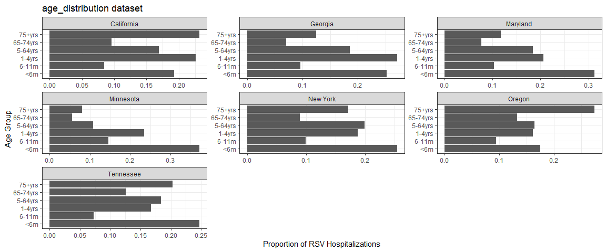

<!-- README.md is generated from README.Rmd. Please edit that file -->

# R.Scenario.Vax

<!-- badges: start -->
<!-- badges: end -->

The goal of R.Scenario.Vax is to fit a deterministic, compartmental
transmission model to RSV hospitalization data and provide scenario
projections for the number of hospitalizations averted due to new
immunization products.

## Installation

You can install the development version of R.Scenario.Vax from
[GitHub](https://github.com/) with:

``` r
# install.packages("remotes")
remotes::install_github("chelsea-hansen/R.Scenario.Vax")
```

## Example

Here we will walk through an example using data from New York state.

### Sample Data

The package includes 2 built-in data sets based on data from
[RSV-Net](https://data.cdc.gov/Public-Health-Surveillance/Weekly-Rates-of-Laboratory-Confirmed-RSV-Hospitali/29hc-w46k/about_data).

- `timeseries`: Weekly time series of RSV hospitalizations in each state
  (all ages)

- `age_distribution`: The proportion of RSV hospitalizations in each age
  group (based on the 2018-19 and 2019-20 seasons only)

Notes:

- RSV-Net provides data on RSV hospitalization rates. We have converted
  these to an approximate number of hospitalizations for use in the
  model.

- RSV-Net did not include data for children until 2018. For the states
  which contributed data for adults prior to 2018, simulated data for
  children has been added based on the weekly average RSV
  hospitalization rate during the 2018-19 and 2019-20 RSV seasons.



### Step 1: Retrieve starting values and fixed parameters

The `get_data` function will retrieve the fixed parameter values as well
as the population data needed to run the model. This function returns a
list with 3 values. 1. Fixed parameters 2. Initial values for model
compartments 3. Vectorized version of 2 from above

``` r
library(R.Scenario.Vax)

ny_data = get_data(state_or_county="state",state_abbr="NY",county_name=NULL)

fixed_parameters = ny_data[[1]]
yinit = ny_data[[2]]
yinit.vector = ny_data[[3]]
```

### Step 2: Fit model to data

the `fit_model` function will find the best fit parameters using maximum
likelihood estimation. The model will fit 7 parameters in total. But
first we will extract the data for New York from the sample data sets.
We also only want to fit to data before the COVID-19 pandemic. The
function will produce a figure when the fitting is complete showing the
fit to the timeseries and age distribution data.

``` r

timeseries_ny = timeseries %>% filter(state=="New York",date<'2020-04-01')
age_distribution_ny = age_distribution %>% filter(state=="New York")

fitNY = fit_model(time_series = timeseries_ny$value, 
                  age_dist = age_distribution_ny$proportion, 
                  parmset = fixed_parameters,
                  yinit = yinit,
                  yinit.vector = yinit.vector)
```


### Step 3: Scenario Projections

Once you have the fitted parameters use the `scenario_projection`
function to run scenario projections for the number of RSV
hospitalizations based on the number of immunizations administered. We
are only running one example here, but you can run many scenarios

``` r

scenarioA = scenario_projection(fitted_parms  = fitNY,
                                parmset = fixed_parameters,
                                yinit=yinit,
                                yinit.vector=yinit.vector,
                                data_start = '2016-10-08',
                                projection_start = '2024-10-01',
                                projection_end = '2025-06-01',
                                senior_start = '2024-08-01',
                                senior_end = '2025-05-01',
                                senior_doses  = 500000,
                                senior_doses_last_year = 1000000,
                                maternal_start = '2024-09-01',
                                maternal_end = '2025-01-31',
                                maternal_doses = 50000,
                                monoclonal_catchup_start = '2024-10-01',
                                monoclonal_catchup_end = '2025-03-01',
                                monoclonal_catchup_doses = 75000,
                                monoclonal_birth_start = '2024-10-01',
                                monoclonal_birth_end = '2025-03-01',
                                monoclonal_birth_doses = 75000,
                                scenario_name="Scenario A",
                                confidence_intervals = TRUE
)
```


